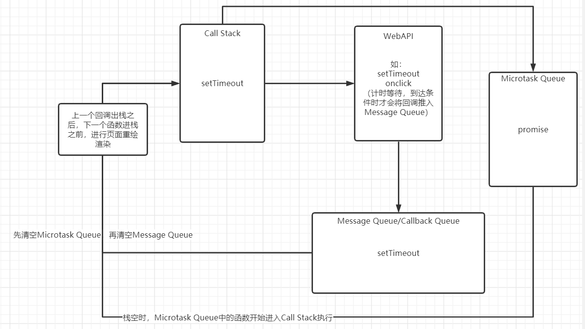

### 事件循环（EventLoop）

结合下面两个大佬的视频：

1. https://www.bilibili.com/video/BV1oV411k7XY（没讲Promise有点遗憾）
2. https://www.bilibili.com/video/BV1kf4y1U7Ln（虽然只有两分钟，但讲的及其清楚）

我大概结合了一下两位大佬讲的东西

1. `Call stack`：函数调用栈，这里叫法有统一标准，两个视频中都一样。
2. `宏任务`：可以被叫做 `Message Queue` 也可以被叫做 `Callback Queue`，其实我也不知道对不对，但是 setTimeout 是宏任务，在两个视频中分别放入了以上两个 `Queue`，所以这里暂且合并一下。
3. `微任务`：`Microtask Queue`，很遗憾第一个视频中讲课的大佬说 PPT 被他弄坏了，就没讲 `promise`，虽然是 14 年演讲的视频了，但是第二个视频中，微任务队列就叫 `Microtask Queue`，就是专门为了放最为代表的 `promise.then` 中的回调。
4. `webAPI`： 第一个视频中提及的一块，`setTimeout` 执行时先在 `callStack` 中，然后到 `webAPI` 这一块进行倒计时，计时结束后会被推入 `Message Queue`（或者 `Calback Queue`），然后等到 `Call stack` 调用栈为空的时候，再从 `Message Queue` 中拿出一个函数来执行，注意只拿出一个，然后等 `Call stack` 为空时再拿第二个，这是第一个视频中讲的，但是没有 `Microtack Queue`，现在结合第二个视频，在 `Call stack` 为空时，先要清空微任务队列，然后才拿下一个宏任务。
5. 页面渲染：浏览器每隔 `16.6 毫秒`就会对页面进行一次重绘，这种尽可能快的重绘会让页面保持每秒 `60 帧`，但是重绘过程受`JavaScript`的影响，**`Call stack 调用栈尚未清空时是无法进行重绘的，如果调用栈中的函数执行时间过长（如死循环），调用栈一直无法清空，会导致页面卡死，无法点击或做任何交互操作`**，页面会在一个函数出栈，另一个函数进栈的时候（此时栈空），进行页面渲染。所以建议不要在栈中
   堆积过多耗时的代码。

哎，感觉事件循环这个东西不是动态图说不清楚啊，画不出来呢个感觉。
